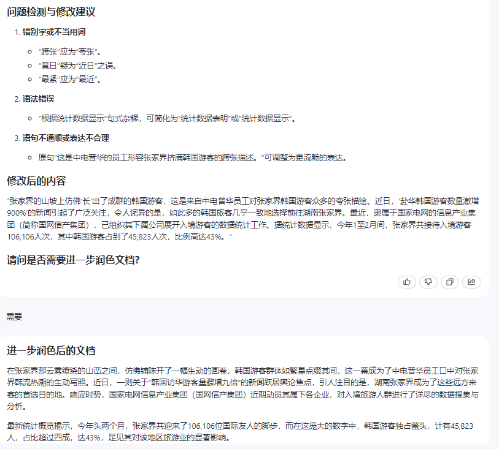

# 检查文档

## 功能说明

本提示词用于检查编制文档是否存在通用的问题：

1. 编写错误或错别字
1. 是否存在语法错误
1. 表达是否通顺合理
1. 是否存在敏感词
1. 是否使用错误的缩写

## Chat版本
### 提示词模板

```
### Instruction ###

Please check the text content within the 'Input Data' according to the following rules.
 - spelling errors or typos
 - grammatical mistakes
 - Fluency & Logic
 - Sensitive Words
 - Terms or Abbreviations：the usage of terms or abbreviations must be consistent with the terms list in the 'Context'

### Context ###

--- the terms list --

| Term                     | Abbreviations  | Error Samples                      |
|--------------------------|----------------|------------------------------------|
| 企业资源管理系统           | ERP           |                                     |

### Output Indicator ###
 - Firstly, categorize the rules and present, the detected issues for each rule are displayed in an unordered list format. every issue include the location、 correction suggestions.
 - Lastly, display "Corrected content follows:" followed by the assitant corrected content.

### Input Data ###

%s


```

### 示例及结果

将上述示例中 %s 替换成真实文档：

```
“张家界的山上‘长’满了韩国人。”这是中电普华的员工形容张家界挤满韩国游客的跨张描述。竟日，“赴华韩国游客数量暴增900%”的新闻登上热搜，让人意想不到的是，这些韩国游客几乎都是直奔湖南张家界。最紧，隶属于国网的信产集团，组织下属公司的员工对入境游客进行数据统计。根据统计数据显示，今年1～2月，张家界接待入境游客106106人次，其中韩国游客45823人次，占比高达43%。
```


#### ChatGPT-4 Output ####


#### 通义千问 Output ####

- <p style="color:red;weight:bolder;">本模型会在列表中丢失问题，但是修改内容中自动做了修正</p>




## API版本

API版本对于返回结果要限定输出格式，可以使用接口直接进行数据处理。

```
### Output Indicator ###
 - 
```


### 其他设置 ###

